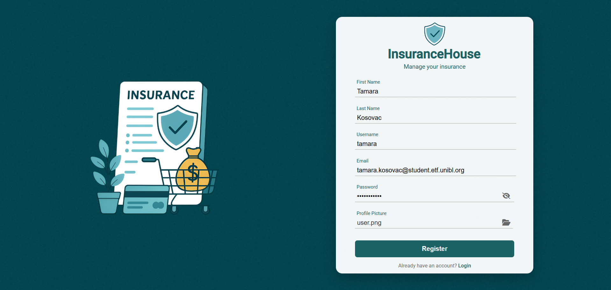
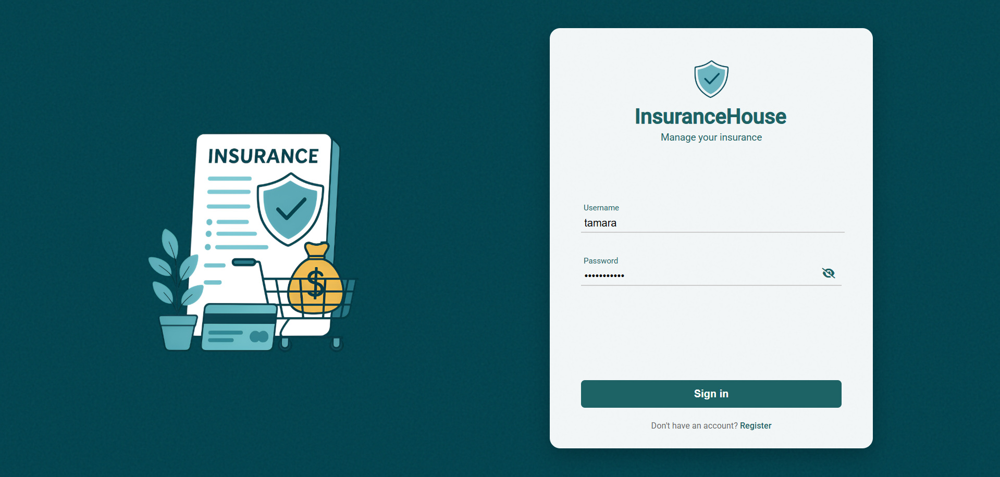
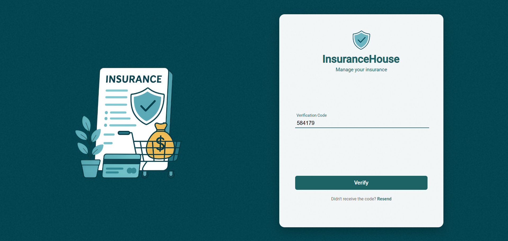

# 🛡️ InsuranceHouse

**InsuranceHouse** is a university project that implements a secure, HTTPS-enabled web-based insurance management system using Spring Boot, Angular, and MySQL. The system is divided into two applications: one for clients and one for administrators. It supports user registration, two-factor authentication (with a verification code sent via email), policy browsing and purchase, as well as administrative control over users and services. Key features include Single Sign-On (SSO), Stripe sandbox payment integration, PDF policy generation, and real-time security and system monitoring, including logging of extremely large payments and multiple failed login attempts.

## 📑 Content
- Authentication
- Admin and employee application
- Client application

## 🏠 Authentication
Users of the application first register, then log in, after which a verification code is sent to their email to be entered as part of two-factor authentication. Administrator can additionally log in using Single Sign-On (SSO), which also grants access to the client application without requiring a separate login.

 

 

 

## 🛠️ Admin and employee application
The administrator has the following options:

 - Overview, addition, modification, deletion, and search of all users in system

   

   
  
 - Overview, addition, modification, deletion, and search of all insurance policies in the system

  

  

  - An employee can only view and search other users, but has full access to manage policies just like an admin

## 👥 Client application
The client has the following options:

 - Browsing and purchasing insurance policies, where after the purchase a PDF document with purchase details is automatically sent to the client via email

  

  

 - Overview of purchased insurance policies and additional purchase details

  

## 📄 Reference to the detailed description
Detailed description of the project can be found in the folder "Description".